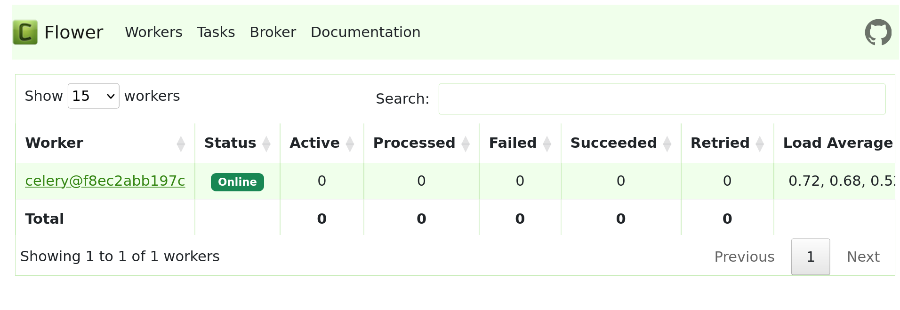

# Система управления задачами

Этот проект представляет собой простую систему управления задачами, созданную с использованием Django, Celery, RabbitMQ, Elasticsearch и Docker. Система включает в себя:

- REST API для управления задачами (CRUD операции)
- Асинхронную обработку задач с использованием Celery и RabbitMQ
- Мониторинг задач с помощью Flower
- Функционал поиска задач с использованием Elasticsearch

[Исходное задание здесь:](./2engine_pdev_task.md)
## Запуск приложения

Для запуска приложения необходимо использовать Docker. Для этого выполните следующие шаги:

1. Убедитесь, что у вас установлен Docker.
2. В корневой директории проекта выполните команду:

   ```bash
   docker-compose up --build -d
3. Проверьте наличие запущенных приложений на портах 8000, 5555, 9200

   ```bash
   sudo lsof -i :8000
   sudo lsof -i :9200
   sudo lsof -i :5555
4. Создание задачи через api с помощью curl:

   ```bash
   curl -X POST http://localhost:8000/api/tasks/ -H "Content-Type: application/json" -d '{"title": "Test_Task_Curl1", "description": "Task from Curl 1", "status": "queued"}
5.  Создание задачи через api с помощью curl:

   ```bash
   curl -X PUT http://localhost:8000/api/tasks/{1}/ -H "Content-Type: application/json" -d '{"title": "Updated Task", "description": "Updated"}'
6.  Удаление задачи через api с помощью curl:

   ```bash
   сurl -X DELETE http://localhost:8000/api/tasks/{1}/
7. Получение списка задач с помощью curl:

   ```bash
   сurl -X DELETE http://localhost:8000/api/tasks
8. Поиск задачи через Elasticsearch с помощью curl:

   ```bash
   curl http://localhost:8000/api/search_tasks/?q=1task
9. Работа Flower для мониторинга Celery:
   - необходимо запустить в браузере ссылку вида:
      http://localhost:5555
   - в окне   можно наблюдать
     запущенные задачи и их атрибуты.